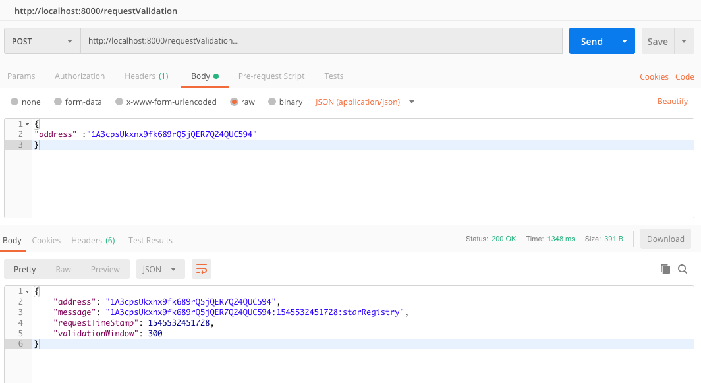
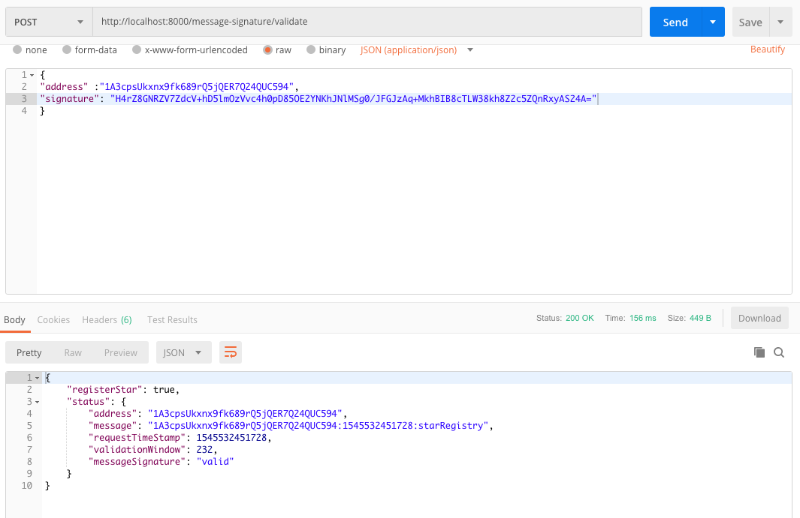
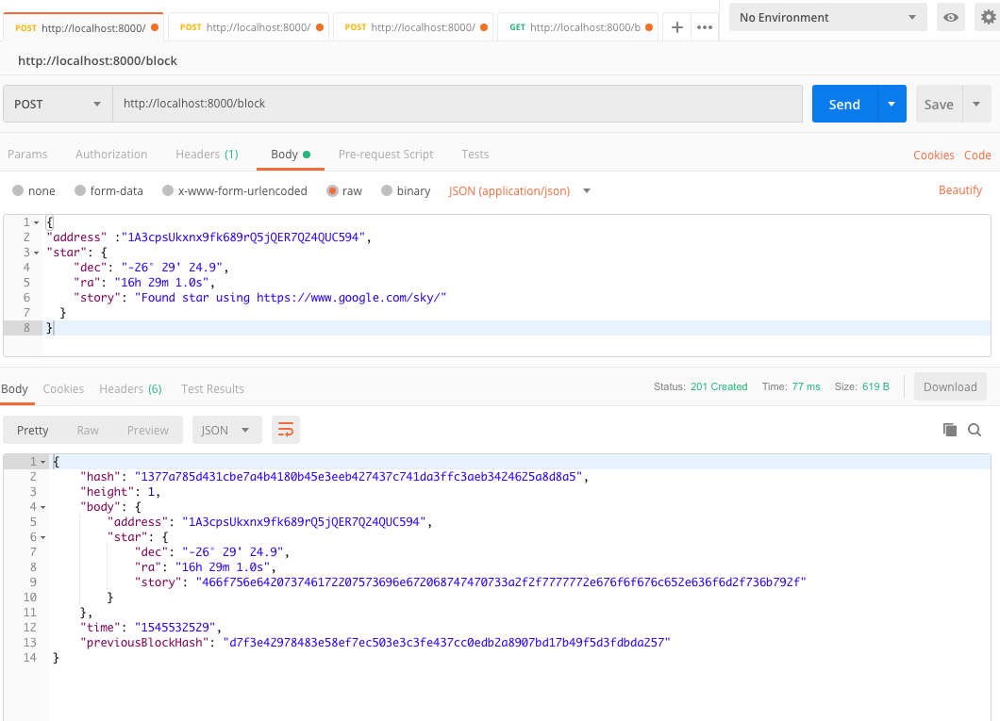
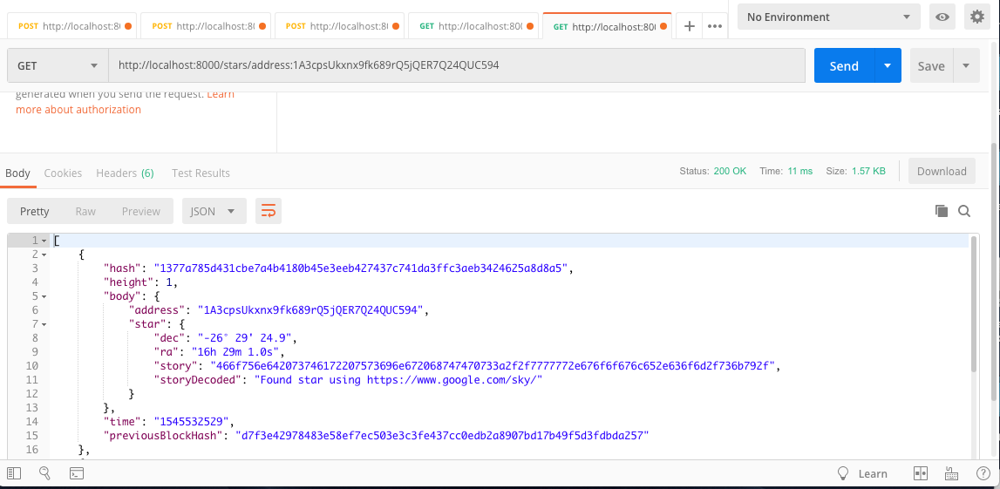
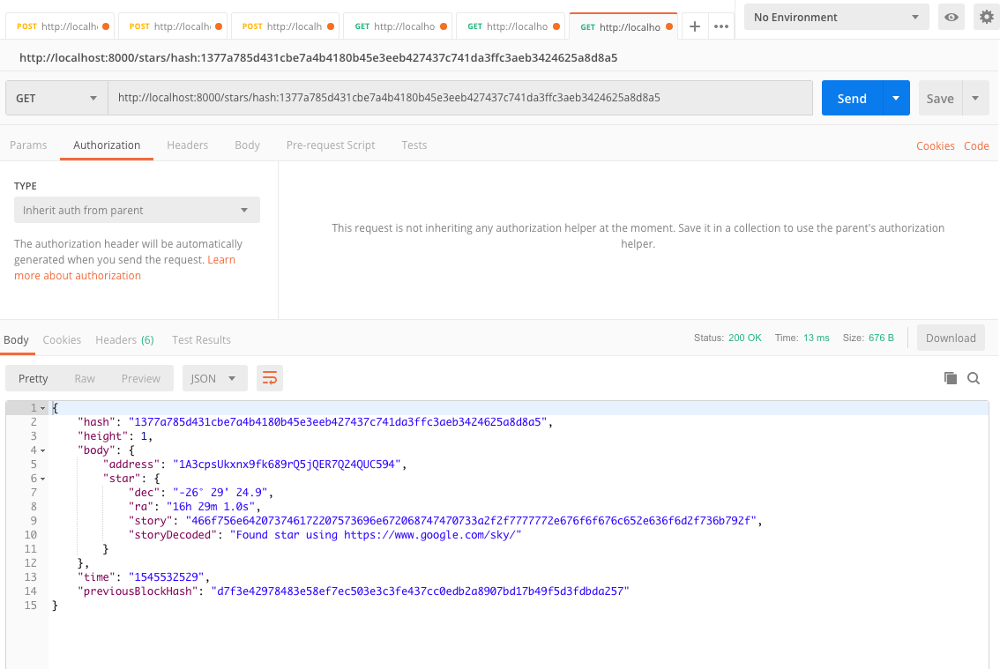
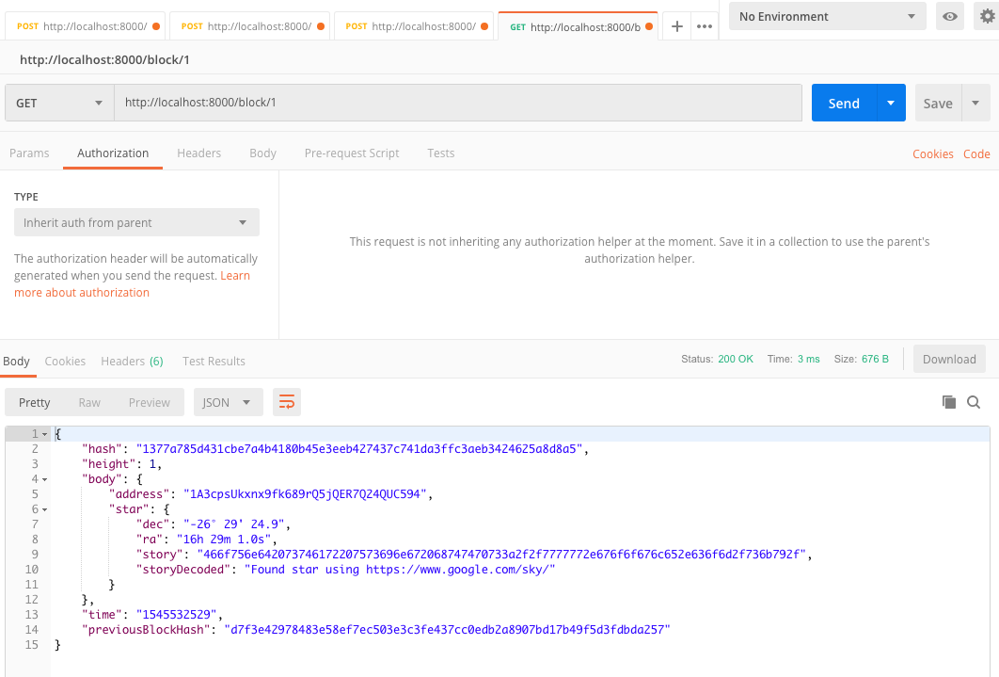

# Udacity Blockchain Developer Nanodegree - Project 4


Welcome to Project 4: Build a Private Blockchain Notary Service!

In this project, you'll build a Star Registry service that allows users to claim ownership of their favorite star in the night sky.

To do this, you'll add functionality to the Web API you built in Project 3: Web Services. You'll connect this web service to your own private blockchain, allowing users to notarize ownership of a digital asset, in this case whichever star they choose.

You'll do this using skills you've learn throughout the program, and by solving some new challenges you haven't quite seen before. The goal is to apply the tools and knowledge you've developed so far to solve new problems that are relevant to your career as a blockchain developer.

## Select Node.js framework

For the development of the project we used the [Express framework](https://expressjs.com/).

## Getting Started

```
npm install
```

## Run the project

```
npm start
```

## Project endpoints

Several tools are available on the internet to assist with API development and testing. If your having troubles testing your endpoints, try one of the tools listed below:

* Postman is a powerful tool used to test web services. It was developed for sending HTTP requests in a simple and quick way.
* CURL is a command-line tool used to deliver requests supporting a variety of protocols like HTTP, HTTPS, FTP, FTPS, SFTP, and many more.


#### 1. Validate User Request endpoint
```
http://localhost:8000/requestValidation
```

Curl example:
```
curl -X "POST" "http://localhost:8000/requestValidation" \
     -H 'Content-Type: application/json; charset=utf-8' \
     -d $'{
  "address": "1A3cpsUkxnx9fk689rQ5jQER7Q24QUC594"
}'
```

  


#### 2. Allow User Message Signature endpoint
```
http://localhost:8000/message-signature/validate
```

Curl example:
```
curl -X "POST" "http://localhost:8000/message-signature/validate" \
     -H 'Content-Type: application/json; charset=utf-8' \
     -d $'{
  "address": "1A3cpsUkxnx9fk689rQ5jQER7Q24QUC594",
  "signature": "H+JcSCFJ6OlqG+7l7g0G7c5XX+5twIC+7vUBcK+uV/aSGxM/98ExXSWWaLCJfOicyRDkF2q9H7fMS7FJxOUmqnE="
}'
```
  


#### 3. Block with star object endpoint
```
http://localhost:8000/block
```

Curl example:
```
curl -X "POST" "http://localhost:8000/block" \
     -H 'Content-Type: application/json; charset=utf-8' \
     -d $'{
  "address": "1A3cpsUkxnx9fk689rQ5jQER7Q24QUC594",
  "star": {
    "dec": "-26° 29'\'' 24.9",
    "ra": "16h 29m 1.0s",
    "story": "Found star using https://www.google.com/sky/"
  }
}'
```
  


#### 4. Blockchain Wallet Address endpoint
```
http://localhost:8000/stars/address:[ADDRESS]
```

Curl example:
```
curl "http://localhost:8000/stars/address:1A3cpsUkxnx9fk689rQ5jQER7Q24QUC594"
```

  


#### 5. Star Block Hash endpoint
```
http://localhost:8000/stars/hash:[HASH]
```

Curl example:
```
curl "http://localhost:8000/stars/hash:1377a785d431cbe7a4b4180b45e3eeb427437c741da3ffc3aeb3424625a8d8a5"
```
  

#### 6. Star Block Height endpoint
```
http://localhost:8000/block/[HEIGHT]
```

Curl example:
```
curl "http://localhost:8000/block/1"
```

  

## Udacity honor code

Giving credits for places that helped me to do this project

- Thanks  [Bruno Tomé](https://github.com/ibrunotome) and [Deepak Gupta](https://github.com/deepakmits) for the help with the doubts.
- [Express Validator Doc](https://express-validator.github.io/docs/custom-validators-sanitizers.html)
- https://stackoverflow.com/questions/1787939/check-time-difference-in-javascript
- https://stackoverflow.com/questions/14313183/javascript-regex-how-do-i-check-if-the-string-is-ascii-only
- https://stackoverflow.com/questions/9177598/multiple-instances-of-a-leveldb-database-at-the-same-time

#### Extra: Project best practices

- [https://www.terlici.com/2014/08/25/best-practices-express-structure.html](https://www.terlici.com/2014/08/25/best-practices-express-structure.html)
- [https://medium.com/@mwaysolutions/10-best-practices-for-better-restful-api-cbe81b06f291](https://medium.com/@mwaysolutions/10-best-practices-for-better-restful-api-cbe81b06f291)
- [https://github.com/i0natan/nodebestpractices](https://github.com/i0natan/nodebestpractices)
- [https://stackoverflow.com/questions/5178334/folder-structure-for-a-node-js-project](https://stackoverflow.com/questions/5178334/folder-structure-for-a-node-js-project)
- [https://gist.github.com/lancejpollard/1398757](https://gist.github.com/lancejpollard/1398757)
